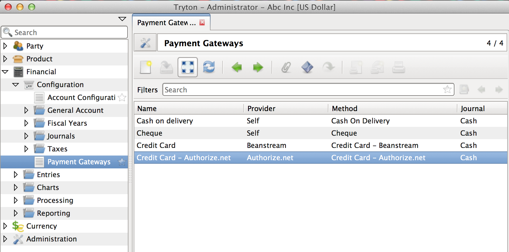
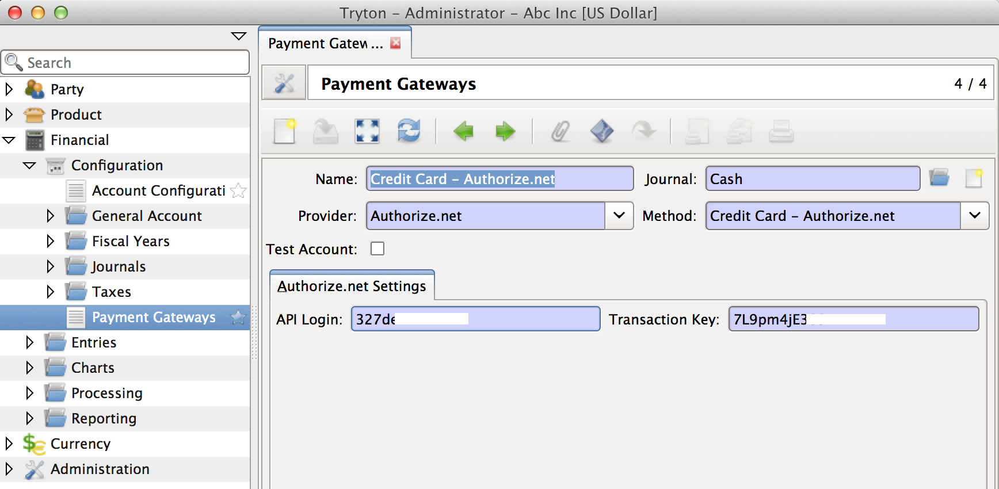
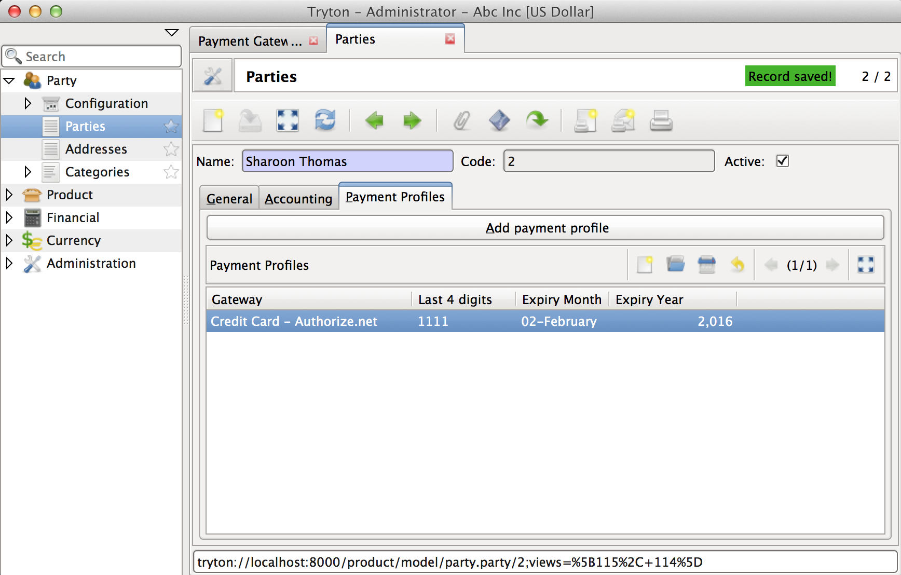
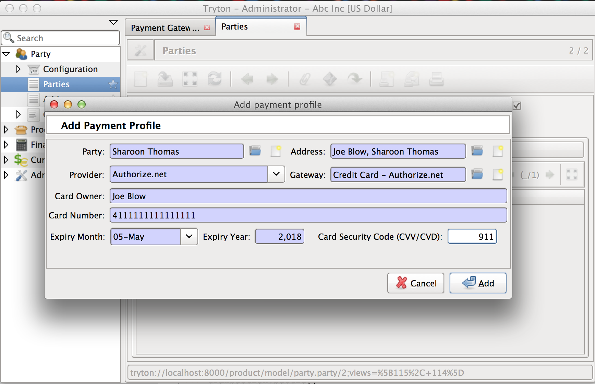
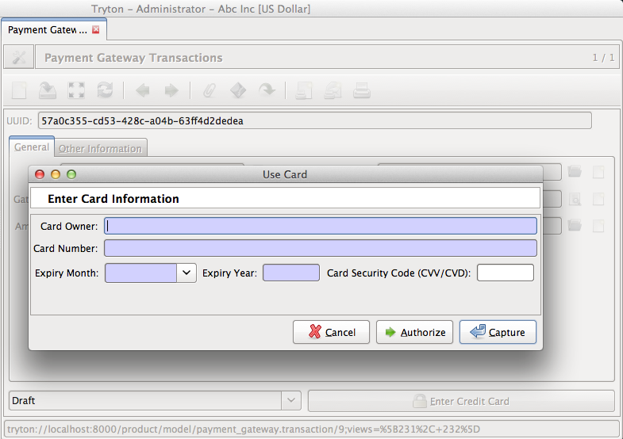
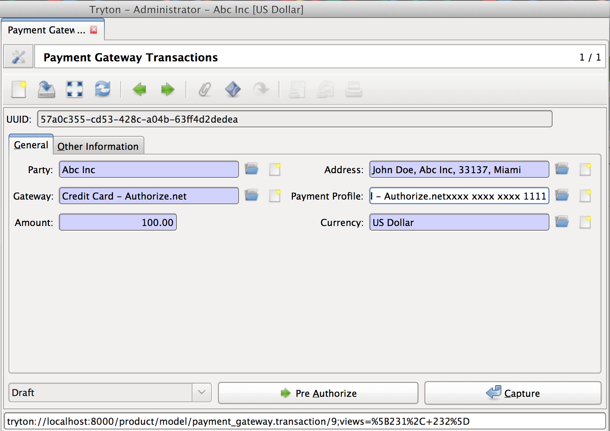

Introduction
============

The payment-gateway module offers a flexible payments model which allows
multiple payment gateways to co-exist in a single Tryton database. The
logic for storing payment profile and transactions are decoupled from the
gateway specific implementation itself making it easy to create custom
payment gateways with their own processing logic and feature sets.

Payment Gateway
---------------

Payment gateway represents a specific method of payment by a specific
provider (like Authorize.net, Paypal etc.). Each payment gateway may
require additional configuration settings specific to it.



Adding payment gateway
``````````````````````



See :py:class:`PaymentGateway`.

.. _payment-profile:

Payment Profile - Store Credit Card data
----------------------------------------

Several payment gateway service providers offer a secure way to store
confidential customer credit card information on their server.
Transactions can then be processed against these profiles without the need
to recollect payment information from the customer, and without the need
to store confidential credit card information in Tryton.

This model represents a profile thus stored with any of the third party
providers. The module only stores the last 4 digits and expiration date in the
database. Remaining confidential information is stored on the payment service
providers server and a reference to the same is stored in the 
:py:attr:`~PaymentProfile.provider_reference` field. 





See :py:class:`PaymentProfile`.

Payment Transaction
-------------------

The transaction model stores and tracks payments that are made using the
payment gateways. 

When a transaction is created, it is assigned a unique :py:func:`uuid.uuid4`.
This is used as transaction reference when transactions are sent to payment
gateways. Without this identifier, some providers mistakenly report
duplicate payments.

See :py:class:`PaymentTransaction`.

States of a Transaction
```````````````````````
=============   ========================================================
State           Description
=============   ========================================================
Draft           The transaction is just being filled by the user.
                This is the default state where every transaction begins
In Progress     Some gateways do not immediately return a success of
                failure of a transaction. Such transactions could be moved
                to the in-progress state and the status of the transaction
                is queried later to see if the transaction succeeded or
                failed.
Failed          The transaction failed. The reasons can be seen from the
                logs.
Authorized      The transaction has been authorized, but not settled.
Completed       The transaction has been captured, but the account moves
                itself, has not been created within Tryton.
Posted          The transaction is complete and the necessary account
                moves have also been created.
Canceled        The transaction was cancelled.
=============   ========================================================

Transaction using card
``````````````````````



.. image:: images/payment-transaction-use-card.png

Transaction using payment profile
``````````````````````````````````




Safe Posting
````````````

Completion of a successful payment gateway transaction also includes
creating the corresponding accounting entries in Tryton. But, creation of
account move requires a journal with proper debit and credit accounts (not
required when the journal is created) and a fiscal period to exist on the
date of the transaction. Hence, if the system was to make the account move
along with the transaction capture or authorization, it could lead to
inconsistencies since the capture/authorize could have already been
completed on the payment gateway but the creation of account move might
result in the failure of the entire transaction change.

To solve the problem, the design introduces a `completed` stage 
during which no account moves are created. This state makes a 
transition with minimal scope for error (a single state field 
is update), to be available. This is important since a transaction
rollback due to any error could lead to Tryton having an inconsistent
state of the transaction compared to the gateway.

In addition to this the transaction model offers a 
:py:meth:`~PaymentTransaction.safe_post` method which tries to
post the transaction, but leaves the transaction in the current state on
failure. The user could later look into the completed transaction and post
them manually.


Payment Transaction Log
-----------------------

The transaction log model stores responses from the payment service
provider. When a response is is received from a payment service provider,
it could be passed onto 
:py:meth:`TransactionLog.serialize_and_create`, which would
then serialize the response object as `YAML`_ and store it. The responses can
be useful in identifying the reason why a transaction may have failed.


.. _YAML: http://en.wikipedia.org/wiki/YAML
